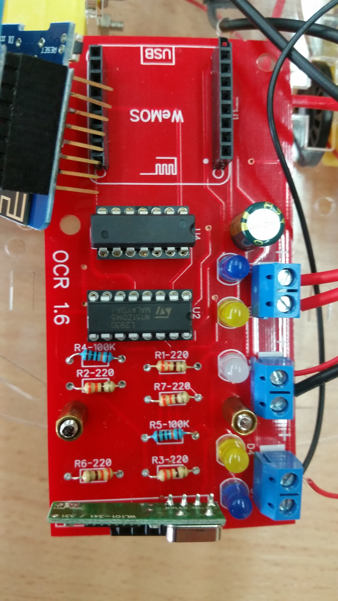
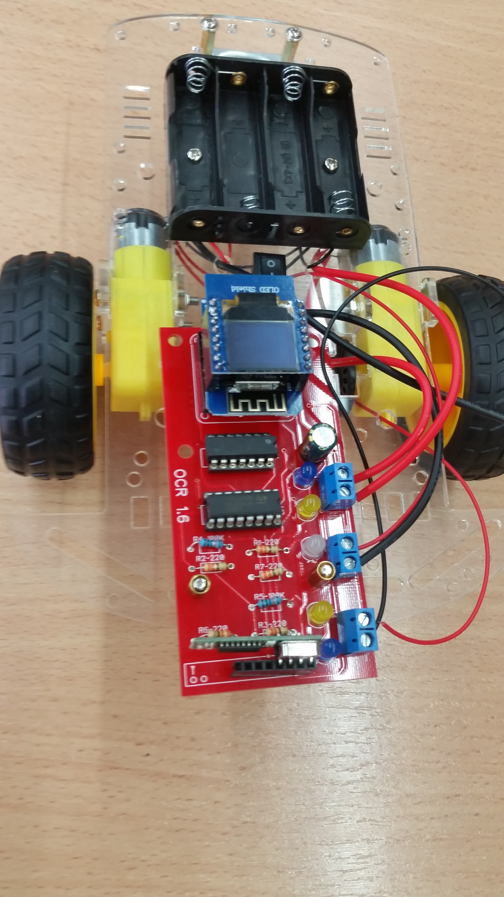

1) Build the chassis:
   The chassis is the platform to which the rest of the parts are connected.
   Build the chassis according to the attached instructions.
   When done, you should have the two motors and the battery holder attached to the chassis.

2) Solder the robot 'brain' and the associated display:
It is critical that all those parts are soldered exactly perpendicular.
    - the female 'socket' that connect the brain to the PCB
    - the male/female socket that is soldered to the brain
    - The 'male' pins that are soldered to the display.

The "brain" is the Wemos D1 Mini.

3) Build the electronic board. For this, you will need to solder the parts detailed at "Robot_hardware" to the supplied PCB.

The integrated circuits used:
- U1 is "Hex inverters" SN74LS04.
- U2 is "Bridge Power Driver" L239D
 
It is good to start with parts at the center, which are not high (because high parts make access to other parts hard).

The assembled PCB.

Note: The RF-receiver at the very bottom is optional.

4) Program the ESP8266 module
TBD

5) Connect everything together:
   Mount the PCB on the chassis. Connect the wires from the motors to the PCB. Connect the wires from the battery holder to the PCB.

The completed robot.

5) Test
   Turn on the robot. The robot should go forward about a meter and then back about a meter

