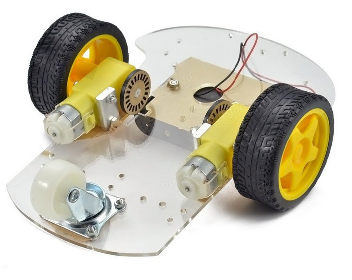
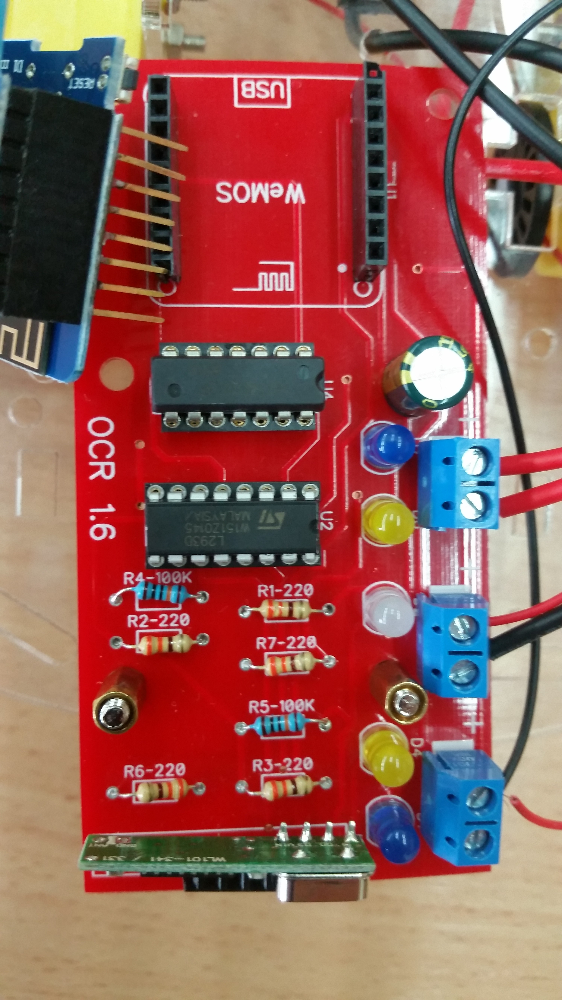
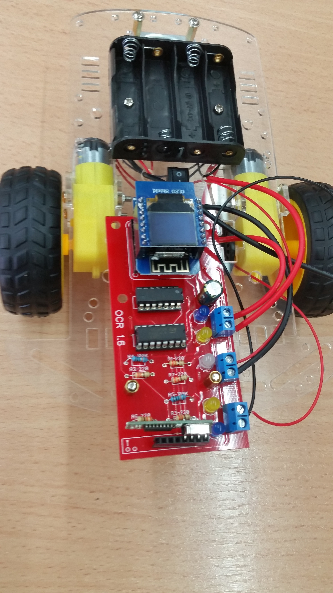

#Building the Robot</h3>

Step by Step instructions for building the robot.

## Overview

- [Get the Hardware](#get-the-hardware)
- [Build the chassis](#build-the-chassis)
- [Build the Electronics](#build-the-electronics)
- [Setup a PC](#setup-a-pc)
- [Program the robot brain](#program-the-robot-brain)
- [Connect everything together](#connect-everything-together)
- [Test](#test)
- [Next steps](#next-steps)

## Get the Hardware

TBD

## Build the Chassis

   The chassis is the platform to which the rest of the parts are connected.
   The attached parts are: the battery holder, the motors, the wheels and the power switch.
   Build the chassis according to the instructions included in the chassis kit.
   When done, you should have the two motors and the battery holder attached to the chassis.

The assembled robot chassis.
Note: the battery-holder wires should be routed to the top, and not as shown.

## Build the Electronics:

### Solder the robot 'brain' and the associated display:

It is critical that all those parts are soldered exactly perpendicular.
    - the female 'socket' that connect the brain to the PCB
    - the male/female socket that is soldered to the brain
    - The 'male' pins that are soldered to the display.

The "brain" is the Wemos D1 Mini.

### Build the electronic board

Here you need to solder the parts detailed at "Robot_hardware" to the supplied PCB.

### The integrated circuits used:

- U1 is "Hex inverters" SN74LS04.
- U2 is "Bridge Power Driver" L239D
 
Tip: Start with parts at the center of the PCB, which are not high (because high parts make access to other parts hard).

The assembled PCB.

Note: The RF-receiver at the very bottom is optional.

## Setup a PC

TBD

## Program the robot brain

TBD

## Connect everything together:

   Mount the PCB on the chassis. Connect the wires from the motors to the PCB. Connect the wires from the battery holder to the PCB.

The completed robot.

## Test

   Turn on the robot. The robot should go forward about a meter and then back about a meter

